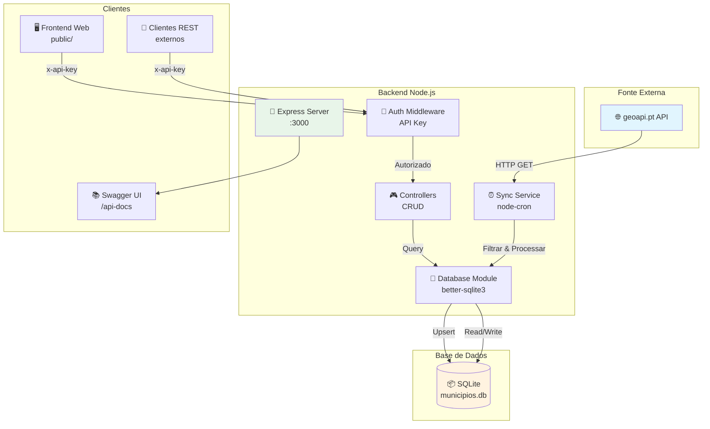
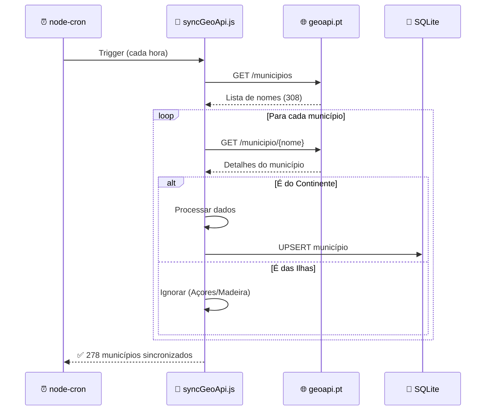
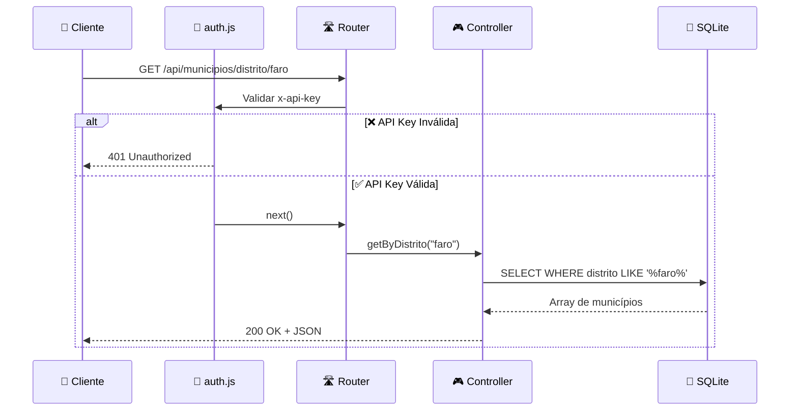
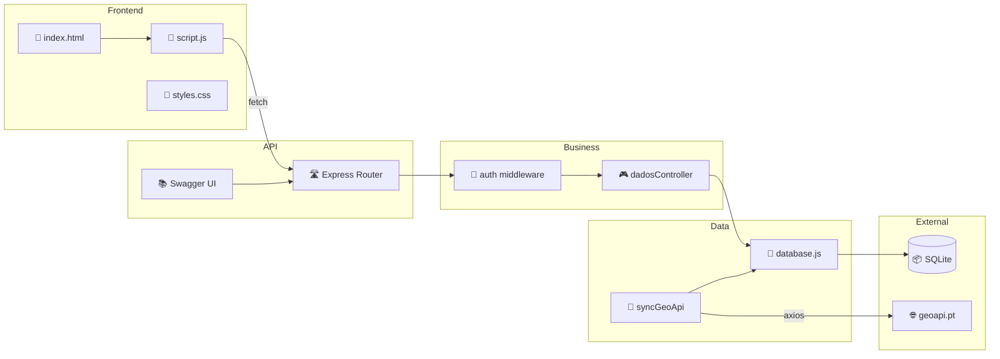
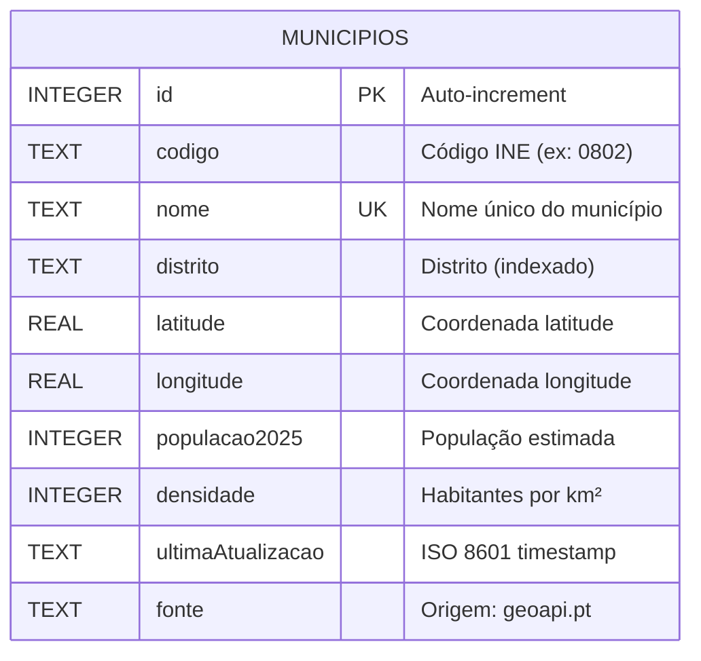

# TP2 - Municípios de Portugal

**Trabalho Prático 2 - Desenvolvimento de Aplicações Web**

> API REST para consulta de dados dos municípios de Portugal Continental, com sincronização automática da API pública geoapi.pt

[](https://nodejs.org/)
[](https://expressjs.com/)
[](https://www.sqlite.org/)
[](LICENSE)

---

## 📋 Índice

- [Descrição](#-descrição)
- [Arquitetura](#-arquitetura)
- [Tecnologias](#-tecnologias)
- [Estrutura do Projeto](#-estrutura-do-projeto)
- [Instalação](#-instalação)
- [Configuração](#-configuração)
- [Utilização](#-utilização)
- [API Endpoints](#-api-endpoints)
- [Diagramas](#-diagramas)
- [Modelo de Dados](#-modelo-de-dados)
- [Autores](#-autores)

---

## 📝 Descrição

Este projeto implementa uma API REST que:

- **Integra** com a API externa [geoapi.pt](https://geoapi.pt) para obter dados dos municípios portugueses
- **Filtra** dados do continente (exclui Açores e Madeira)
- **Processa** e calcula campos derivados (população estimada 2025, densidade populacional)
- **Armazena** os dados numa base de dados SQLite local
- **Sincroniza** automaticamente a cada hora via cron job
- **Disponibiliza** uma API REST com CRUD completo e autenticação por API Key
- **Documenta** todos os endpoints via Swagger/OpenAPI

---

## 🏗 Arquitetura



---

## 🛠 Tecnologias

| Tecnologia | Versão | Descrição |
|------------|--------|-----------|
| **Node.js** | 18+ | Runtime JavaScript |
| **Express** | 5.x | Framework web |
| **better-sqlite3** | 11.x | Driver SQLite síncrono |
| **node-cron** | 4.x | Agendamento de tarefas |
| **Axios** | 1.x | Cliente HTTP |
| **Helmet** | 8.x | Segurança HTTP headers |
| **CORS** | 2.x | Cross-Origin Resource Sharing |
| **Swagger UI** | 5.x | Documentação interativa |
| **dotenv** | 17.x | Variáveis de ambiente |

---

## 📁 Estrutura do Projeto

```
TP2_a79295_a79301_DesenvolvimentoWeb/
├── 📄 package.json          # Dependências e scripts
├── 📄 .env                   # Variáveis de ambiente
├── 📄 .gitignore             # Ficheiros ignorados
├── 📄 README.md              # Documentação
│
├── 📂 data/                  # Base de dados
│   └── 📄 municipios.db      # SQLite database
│
├── 📂 docs/                  # Documentação adicional
│   ├── 📄 arquitetura.md
│   ├── 📄 GUIA_USO_API.md
│   └── 📄 instrucoes-execucao.md
│
├── 📂 public/                # Frontend estático
│   ├── 📄 index.html
│   ├── 📄 script.js
│   └── 📄 styles.css
│
└── 📂 src/                   # Código fonte
    ├── 📄 app.js             # Entry point
    ├── 📄 swagger.yaml       # Documentação OpenAPI
    │
    ├── 📂 config/
    │   └── 📄 swagger.js
    │
    ├── 📂 controllers/
    │   └── 📄 dadosController.js
    │
    ├── 📂 middleware/
    │   └── 📄 auth.js
    │
    ├── 📂 models/
    │   └── 📄 database.js    # Módulo SQLite
    │
    ├── 📂 routes/
    │   └── 📄 dadosRoutes.js
    │
    └── 📂 services/
        └── 📄 syncGeoApi.js
```

---

## 🚀 Instalação

### Pré-requisitos

- Node.js 18 ou superior
- npm ou yarn

### Passos

```bash
# 1. Clonar o repositório
git clone https://github.com/BernardoFr71/TP2_a79295_a79301_DesenvolvimentoWeb.git
cd TP2_a79295_a79301_DesenvolvimentoWeb

# 2. Instalar dependências
npm install

# 3. Configurar variáveis de ambiente
cp .env.example .env
# Editar .env com as suas configurações

# 4. Iniciar o servidor
npm start

# Ou em modo desenvolvimento (com auto-reload)
npm run dev
```

---

## ⚙️ Configuração

Criar ficheiro `.env` na raiz do projeto:

```env
# Porta do servidor
PORT=3000

# Chave de autenticação da API
API_KEY=xxxxx
```

> **Nota:** A base de dados SQLite é criada automaticamente em `data/municipios.db` ao iniciar a aplicação.

---

## 📖 Utilização

### Iniciar o Servidor

```bash
npm start
```

O servidor estará disponível em:
- **API:** http://localhost:3000/api/municipios
- **Swagger UI:** http://localhost:3000/api-docs
- **Frontend:** http://localhost:3000

### Autenticação

Todas as rotas da API requerem autenticação via header:

```
x-api-key: xxxxx
```

### Exemplo com cURL

```bash
# Listar todos os municípios (paginado)
curl -H "x-api-key: a79301" http://localhost:3000/api/municipios

# Pesquisar por nome
curl -H "x-api-key: a79301" http://localhost:3000/api/municipios/nome/Lisboa

# Pesquisar por distrito
curl -H "x-api-key: a79301" http://localhost:3000/api/municipios/distrito/Porto

# Pesquisar por código
curl -H "x-api-key: a79301" http://localhost:3000/api/municipios/codigo/0802
```

---

## 🔌 API Endpoints

| Método | Endpoint | Descrição |
|--------|----------|-----------|
| `GET` | `/api/municipios` | Lista todos (paginado) |
| `GET` | `/api/municipios?distrito=porto` | Filtra por distrito |
| `GET` | `/api/municipios?page=2&limit=10` | Paginação |
| `GET` | `/api/municipios/:id` | Busca por ID |
| `GET` | `/api/municipios/nome/:nome` | Busca por nome |
| `GET` | `/api/municipios/codigo/:codigo` | Busca por código INE |
| `GET` | `/api/municipios/distrito/:distrito` | Lista por distrito |
| `POST` | `/api/municipios` | Criar município |
| `PUT` | `/api/municipios/:id` | Atualizar município |
| `DELETE` | `/api/municipios/:id` | Remover município |

### Exemplo de Resposta

```json
{
  "page": 1,
  "limit": 20,
  "total": 278,
  "totalPages": 14,
  "data": [
    {
      "_id": 1,
      "codigo": "0101",
      "nome": "Abrantes",
      "distrito": "Santarém",
      "coordenadas": {
        "latitude": 39.4667,
        "longitude": -8.2
      },
      "populacao2025": 35000,
      "densidade": 42,
      "ultimaAtualizacao": "2025-12-07T15:42:09.191Z",
      "fonte": "geoapi.pt"
    }
  ]
}
```

---

## 📊 Diagramas

### Fluxo de Sincronização



### Fluxo de Autenticação e Consulta



### Arquitetura de Componentes



---

## 🗄 Modelo de Dados

### Tabela: `municipios`



### Schema SQL

```sql
CREATE TABLE municipios (
    id INTEGER PRIMARY KEY AUTOINCREMENT,
    codigo TEXT,
    nome TEXT NOT NULL UNIQUE,
    distrito TEXT NOT NULL,
    latitude REAL,
    longitude REAL,
    populacao2025 INTEGER,
    densidade INTEGER,
    ultimaAtualizacao TEXT DEFAULT CURRENT_TIMESTAMP,
    fonte TEXT DEFAULT 'geoapi.pt'
);

-- Índices para performance
CREATE INDEX idx_distrito ON municipios(distrito);
CREATE INDEX idx_codigo ON municipios(codigo);
CREATE INDEX idx_ultimaAtualizacao ON municipios(ultimaAtualizacao DESC);
```

---

## 🔒 Segurança

| Medida | Implementação |
|--------|---------------|
| **Autenticação** | API Key via header `x-api-key` |
| **Headers HTTP** | Helmet.js (XSS, CSRF, etc.) |
| **CORS** | Configurado para permitir origens |
| **Validação** | Parâmetros sanitizados nas queries |

---

## 📈 Funcionalidades

- [x] Integração com API externa (geoapi.pt)
- [x] Filtragem de dados (apenas continente)
- [x] Processamento de dados derivados
- [x] Armazenamento em SQLite
- [x] Sincronização automática (cron)
- [x] API REST completa (CRUD)
- [x] Paginação de resultados
- [x] Filtros de pesquisa (nome, código, distrito)
- [x] Autenticação por API Key
- [x] Documentação Swagger/OpenAPI
- [x] Frontend interativo
- [x] Segurança (Helmet, CORS)

---

## 👥 Autores

| Nome | Número |
|------|--------|
| **Bernardo Freitas** | a79295 |
| **Tom'as Anastácio** | a79301 |

**UC:** Desenvolvimento de Aplicações Web  
**Ano Letivo:** 2024/2025

