curl -H "x-api-key: a79301" http://localhost:3000/api/municipios# 📚 Guia de Estudo Completo - TP2 Desenvolvimento Web

> **Objetivo**: Este guia prepara-te para explicar o projeto ao professor e responder a qualquer pergunta sobre as tecnologias, arquitetura e decisões técnicas.

---

## 📑 Índice

1. [Visão Geral do Projeto](#1-visão-geral-do-projeto)
2. [Arquitetura do Sistema](#2-arquitetura-do-sistema)
3. [Tecnologias Utilizadas](#3-tecnologias-utilizadas)
4. [REST API - Conceitos e Implementação](#4-rest-api---conceitos-e-implementação)
5. [Base de Dados SQLite](#5-base-de-dados-sqlite)
6. [Sincronização com API Externa](#6-sincronização-com-api-externa)
7. [Autenticação e Segurança](#7-autenticação-e-segurança)
8. [Documentação OpenAPI/Swagger](#8-documentação-openapiswagger)
9. [Frontend e Interface](#9-frontend-e-interface)
10. [Fluxos de Dados Detalhados](#10-fluxos-de-dados-detalhados)
11. [Componentes do Código](#11-componentes-do-código)
12. [Perguntas Frequentes do Professor](#12-perguntas-frequentes-do-professor)
13. [Glossário de Termos](#13-glossário-de-termos)

---

## 1. Visão Geral do Projeto

### 1.1 O que é o projeto?

Uma aplicação web completa que demonstra integração de sistemas:

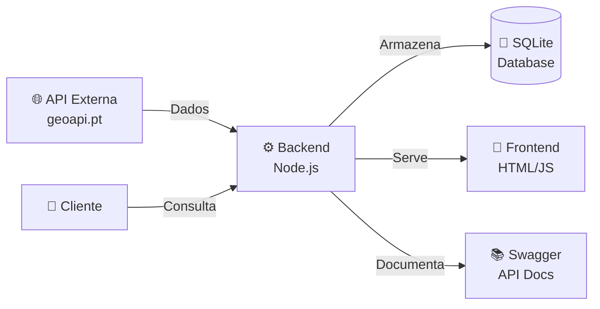

### 1.2 Funcionalidades Principais

| Funcionalidade | Descrição | Requisito do Enunciado |
|----------------|-----------|------------------------|
| **Sincronização** | Busca dados de municípios portugueses | Integração com API externa |
| **Filtragem** | Exclui Açores e Madeira (só continente) | Processamento de dados |
| **Processamento** | Calcula população e densidade | Enriquecimento de dados |
| **Armazenamento** | Guarda em SQLite local | Persistência |
| **API REST** | Expõe endpoints CRUD | Disponibilização de dados |
| **Autenticação** | Protege com API Key | Segurança |
| **Documentação** | Swagger UI interativo | OpenAPI 3.0 |

### 1.3 Fluxo Geral de Funcionamento

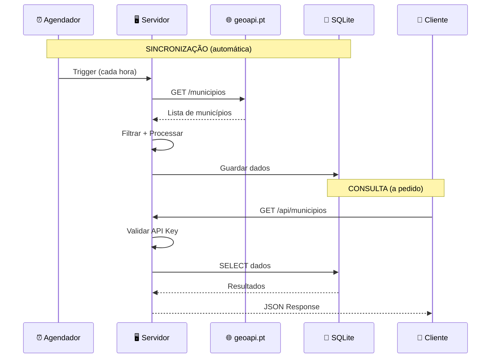

---

## 2. Arquitetura do Sistema

### 2.1 Padrão MVC (Model-View-Controller)

O projeto segue uma arquitetura em camadas inspirada no padrão MVC:

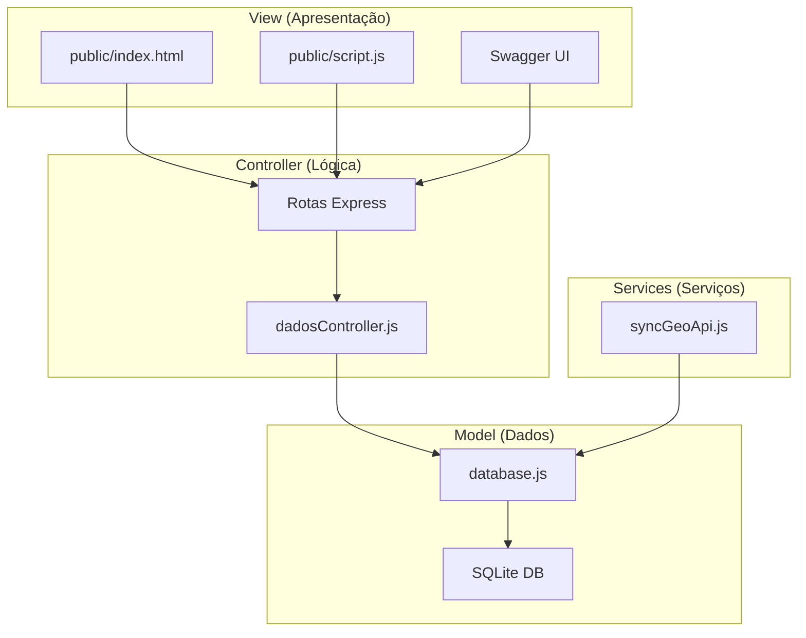

### 2.2 Estrutura de Diretórios Explicada

```
TP2_a79295_a79301_DesenvolvimentoWeb/
│
├── 📁 src/                      # Código fonte do backend
│   ├── 📄 app.js                # ENTRY POINT - Inicia tudo
│   ├── 📄 swagger.yaml          # Documentação da API
│   │
│   ├── 📁 controllers/          # Lógica de negócio
│   │   └── dadosController.js   # Funções CRUD
│   │
│   ├── 📁 models/               # Camada de dados
│   │   └── database.js          # Acesso ao SQLite
│   │
│   ├── 📁 routes/               # Definição de endpoints
│   │   └── dadosRoutes.js       # Rotas /api/municipios
│   │
│   ├── 📁 middleware/           # Processamento intermédio
│   │   └── auth.js              # Validação de API Key
│   │
│   └── 📁 services/             # Serviços externos
│       └── syncGeoApi.js        # Sincronização
│
├── 📁 public/                   # Frontend estático
│   ├── index.html               # Página principal
│   ├── script.js                # Lógica do cliente
│   └── styles.css               # Estilos
│
├── 📁 data/                     # Base de dados
│   └── municipios.db            # Ficheiro SQLite
│
├── 📁 docs/                     # Documentação
│
├── 📄 package.json              # Dependências Node.js
└── 📄 .env                      # Variáveis de ambiente
```

### 2.3 Fluxo de um Pedido HTTP

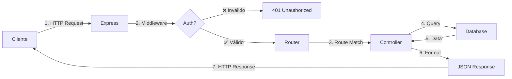

---

## 3. Tecnologias Utilizadas

### 3.1 Node.js

**O que é?**
- Runtime JavaScript fora do browser
- Permite executar JavaScript no servidor
- Baseado no motor V8 do Chrome

**Por que usamos?**
- Exigido no enunciado
- Excelente para aplicações I/O intensivas (muitos pedidos)
- NPM tem milhares de pacotes prontos

**Conceitos importantes:**
```javascript
// Node.js é assíncrono e event-driven
// Exemplo: não bloqueia enquanto espera pelo ficheiro
const fs = require('fs');
fs.readFile('ficheiro.txt', (err, data) => {
    console.log(data); // Executa quando termina
});
console.log('Isto aparece primeiro!'); // Não espera
```

### 3.2 Express.js

**O que é?**
- Framework web minimalista para Node.js
- Facilita criar servidores HTTP e APIs REST

**Conceitos fundamentais:**

```javascript
const express = require('express');
const app = express();

// Middleware - processa TODOS os pedidos
app.use(express.json()); // Converte body para JSON

// Rota - responde a um caminho específico
app.get('/api/dados', (req, res) => {
    res.json({ mensagem: 'Olá!' });
});

// Iniciar servidor
app.listen(3000);
```

**Middleware - O que é?**

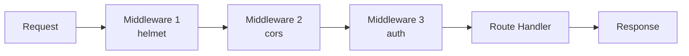

Middleware são funções que:
1. Têm acesso ao `request` e `response`
2. Podem modificar ou terminar o pedido
3. Chamam `next()` para passar ao próximo

```javascript
// Exemplo de middleware
const auth = (req, res, next) => {
    if (req.header('x-api-key') === 'a79301') {
        next(); // Continua para o próximo middleware/rota
    } else {
        res.status(401).json({ erro: 'Não autorizado' });
    }
};
```

### 3.3 SQLite

**O que é?**
- Base de dados relacional embutida
- Guarda tudo num único ficheiro `.db`
- Não precisa de servidor separado

**Por que SQLite e não MongoDB?**

| Aspeto | SQLite | MongoDB |
|--------|--------|---------|
| **Setup** | Zero config | Precisa servidor |
| **Estrutura** | Tabelas (ideal para municípios) | Documentos flexíveis |
| **Portabilidade** | Um ficheiro | Dump complexo |
| **Queries** | SQL padrão | Query language própria |
| **Para este projeto** | ✅ Perfeito | Overkill |

**Exemplo de query:**
```sql
-- Buscar municípios do Porto
SELECT * FROM municipios 
WHERE distrito LIKE '%Porto%'
ORDER BY nome ASC;
```

### 3.4 better-sqlite3

**O que é?**
- Driver Node.js para SQLite
- API síncrona (mais simples que async)
- Muito rápido

**Como usamos:**
```javascript
const Database = require('better-sqlite3');
const db = new Database('municipios.db');

// Preparar query (previne SQL injection)
const stmt = db.prepare('SELECT * FROM municipios WHERE distrito = ?');
const resultados = stmt.all('Faro'); // Executa com parâmetro
```

### 3.5 Axios

**O que é?**
- Cliente HTTP para Node.js e browser
- Faz pedidos a APIs externas

**Como usamos:**
```javascript
const axios = require('axios');

// Buscar dados da API externa
const response = await axios.get('https://json.geoapi.pt/municipios');
const municipios = response.data; // Array de nomes
```

### 3.6 node-cron

**O que é?**
- Agendador de tarefas
- Executa código em horários específicos

**Sintaxe cron:**
```
┌───────────── minuto (0 - 59)
│ ┌─────────── hora (0 - 23)
│ │ ┌───────── dia do mês (1 - 31)
│ │ │ ┌─────── mês (1 - 12)
│ │ │ │ ┌───── dia da semana (0 - 7)
│ │ │ │ │
* * * * *
```

**Como usamos:**
```javascript
const cron = require('node-cron');

// Executar a cada hora (minuto 0)
cron.schedule('0 * * * *', () => {
    console.log('Sincronização iniciada!');
    syncData();
});
```

### 3.7 Helmet & CORS

**Helmet** - Segurança HTTP:
```javascript
app.use(helmet());
// Adiciona headers de segurança:
// - X-Content-Type-Options: nosniff
// - X-Frame-Options: DENY
// - etc.
```

**CORS** - Cross-Origin Resource Sharing:
```javascript
app.use(cors());
// Permite que outros domínios acedam à API
// Sem isto, browsers bloqueiam pedidos de outras origens
```

---

## 4. REST API - Conceitos e Implementação

### 4.1 O que é REST?

**REST** (Representational State Transfer) é um estilo arquitetural para APIs web.

**Princípios REST:**

| Princípio | Descrição | No nosso projeto |
|-----------|-----------|------------------|
| **Stateless** | Cada pedido é independente | Sim, não guardamos sessões |
| **Client-Server** | Separação de responsabilidades | Frontend ↔ Backend |
| **Uniform Interface** | URLs consistentes | `/api/municipios/*` |
| **Cacheable** | Respostas podem ser cacheadas | Headers apropriados |

### 4.2 Métodos HTTP (Verbos)

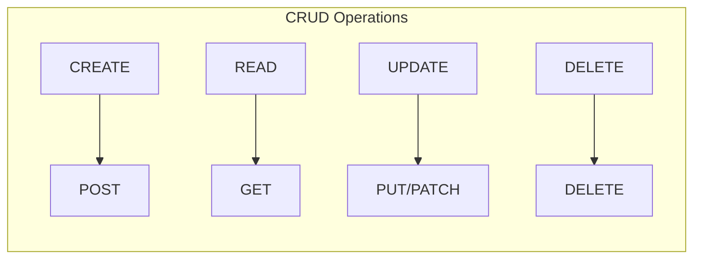

| Método | Ação | Exemplo | Body? |
|--------|------|---------|-------|
| **GET** | Ler dados | `GET /api/municipios` | ❌ |
| **POST** | Criar novo | `POST /api/municipios` | ✅ |
| **PUT** | Atualizar tudo | `PUT /api/municipios/1` | ✅ |
| **DELETE** | Remover | `DELETE /api/municipios/1` | ❌ |

### 4.3 Códigos de Estado HTTP

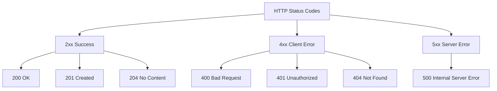

**No nosso projeto:**
- `200` - Sucesso (GET, PUT)
- `201` - Criado com sucesso (POST)
- `401` - API Key inválida
- `404` - Município não encontrado
- `500` - Erro interno

### 4.4 Estrutura dos Endpoints

```
Base URL: http://localhost:3000/api/municipios
```

| Endpoint | Método | Descrição | Resposta |
|----------|--------|-----------|----------|
| `/` | GET | Lista paginada | `{ page, total, data: [...] }` |
| `/:id` | GET | Por ID | `{ _id, nome, ... }` |
| `/nome/:nome` | GET | Por nome | `{ _id, nome, ... }` |
| `/codigo/:codigo` | GET | Por código INE | `{ _id, nome, ... }` |
| `/distrito/:distrito` | GET | Por distrito | `[{ _id, nome, ... }]` |
| `/` | POST | Criar | `{ _id, nome, ... }` |
| `/:id` | PUT | Atualizar | `{ _id, nome, ... }` |
| `/:id` | DELETE | Remover | `{ mensagem: '...' }` |

### 4.5 Query Parameters vs Path Parameters

```
GET /api/municipios?distrito=faro&page=2&limit=10
                    └─────────────────────────────┘
                         Query Parameters

GET /api/municipios/nome/Lisboa
                         └─────┘
                    Path Parameter
```

**Query Parameters** - Para filtros e opções:
```javascript
// No controller
const page = req.query.page || 1;
const distrito = req.query.distrito;
```

**Path Parameters** - Para identificar recurso:
```javascript
// Na rota: /nome/:nome
const nome = req.params.nome; // "Lisboa"
```

### 4.6 Formato de Resposta JSON

**Resposta paginada:**
```json
{
    "page": 1,
    "limit": 20,
    "total": 278,
    "totalPages": 14,
    "data": [
        {
            "_id": 1,
            "codigo": "0802",
            "nome": "Albufeira",
            "distrito": "Faro",
            "coordenadas": {
                "latitude": 37.0889,
                "longitude": -8.2504
            },
            "populacao2025": 44158,
            "densidade": 559,
            "ultimaAtualizacao": "2025-12-07T15:42:09.191Z",
            "fonte": "geoapi.pt"
        }
    ]
}
```

**Resposta de erro:**
```json
{
    "erro": "Município não encontrado"
}
```

---

## 5. Base de Dados SQLite

### 5.1 Estrutura da Tabela

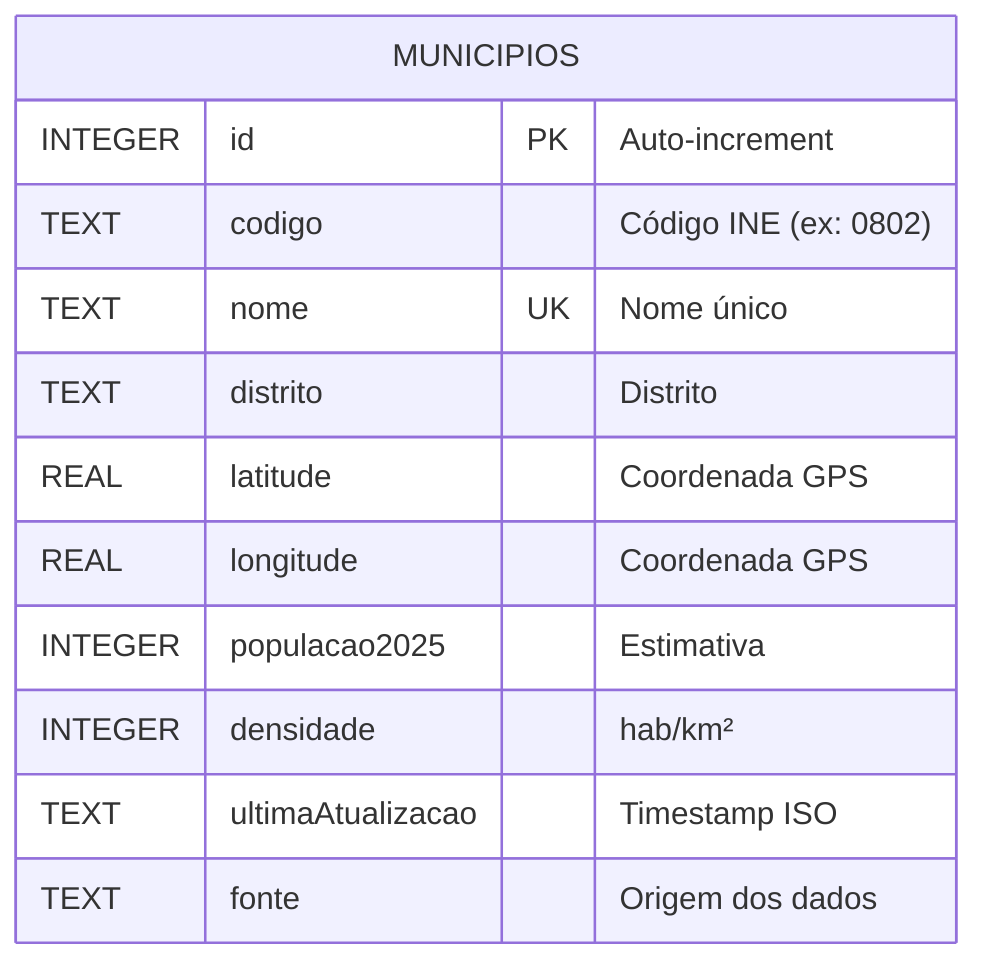

### 5.2 Schema SQL Completo

```sql
CREATE TABLE municipios (
    id INTEGER PRIMARY KEY AUTOINCREMENT,
    codigo TEXT,
    nome TEXT NOT NULL UNIQUE,
    distrito TEXT NOT NULL,
    latitude REAL,
    longitude REAL,
    populacao2025 INTEGER,
    densidade INTEGER,
    ultimaAtualizacao TEXT DEFAULT CURRENT_TIMESTAMP,
    fonte TEXT DEFAULT 'geoapi.pt'
);

-- Índices para performance
CREATE INDEX idx_distrito ON municipios(distrito);
CREATE INDEX idx_codigo ON municipios(codigo);
CREATE INDEX idx_ultimaAtualizacao ON municipios(ultimaAtualizacao DESC);
```

### 5.3 O que são Índices?

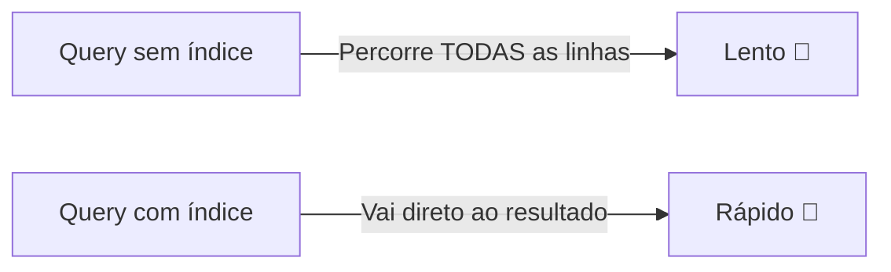

**Índice** = "Índice de um livro"
- Permite encontrar dados rapidamente
- Criamos em colunas que usamos em `WHERE` e `ORDER BY`

### 5.4 UPSERT - Insert ou Update

```sql
INSERT INTO municipios (codigo, nome, distrito, ...)
VALUES (@codigo, @nome, @distrito, ...)
ON CONFLICT(nome) DO UPDATE SET
    codigo = excluded.codigo,
    distrito = excluded.distrito,
    ...
```

**O que faz:**
1. Tenta inserir novo registo
2. Se `nome` já existe (CONFLICT), atualiza em vez de inserir
3. `excluded.` refere-se aos valores que tentámos inserir

---

## 6. Sincronização com API Externa

### 6.1 Fonte de Dados: geoapi.pt

**O que é?**
- API pública gratuita
- Dados geográficos de Portugal
- Inclui municípios, freguesias, códigos postais

**Endpoints usados:**
```
GET https://json.geoapi.pt/municipios
    → ["Abrantes", "Albufeira", "Alcácer do Sal", ...]

GET https://json.geoapi.pt/municipio/Albufeira
    → { "Concelho": "Albufeira", "Distrito": "Faro", ... }
```

### 6.2 Processo de Sincronização

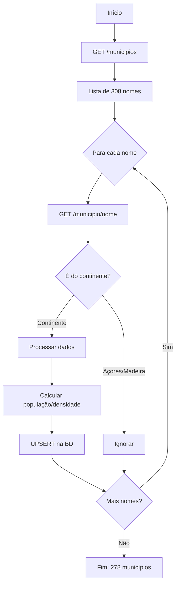

### 6.3 Código de Sincronização Explicado

```javascript
const syncData = async () => {
    // 1. Buscar lista de todos os municípios
    const response = await axios.get('https://json.geoapi.pt/municipios');
    const nomes = response.data; // Array de 308 nomes

    for (const nome of nomes) {
        // 2. Buscar detalhes de cada município
        const detalhes = await axios.get(
            `https://json.geoapi.pt/municipio/${encodeURIComponent(nome)}`
        );
        const m = detalhes.data;

        // 3. Filtrar ilhas
        if (['Açores', 'Madeira'].includes(m.Distrito)) {
            continue; // Salta para o próximo
        }

        // 4. Processar dados
        const populacao2025 = m.censos2021?.N_INDIVIDUOS || 0;
        const areaKm2 = m.area_ha / 100;
        const densidade = Math.round(populacao2025 / areaKm2);

        // 5. Guardar na base de dados
        upsertMunicipio({
            codigo: m.codigoine,
            nome: m.Concelho,
            distrito: m.Distrito,
            populacao2025,
            densidade,
            // ...
        });

        // 6. Delay para não sobrecarregar API
        await new Promise(r => setTimeout(r, 100));
    }
};
```

### 6.4 Agendamento com Cron

```javascript
// Executar sincronização:
// 1. Imediatamente ao iniciar
syncData();

// 2. A cada hora (minuto 0)
cron.schedule('0 * * * *', () => {
    syncData();
});
```

---

## 7. Autenticação e Segurança

### 7.1 Autenticação por API Key

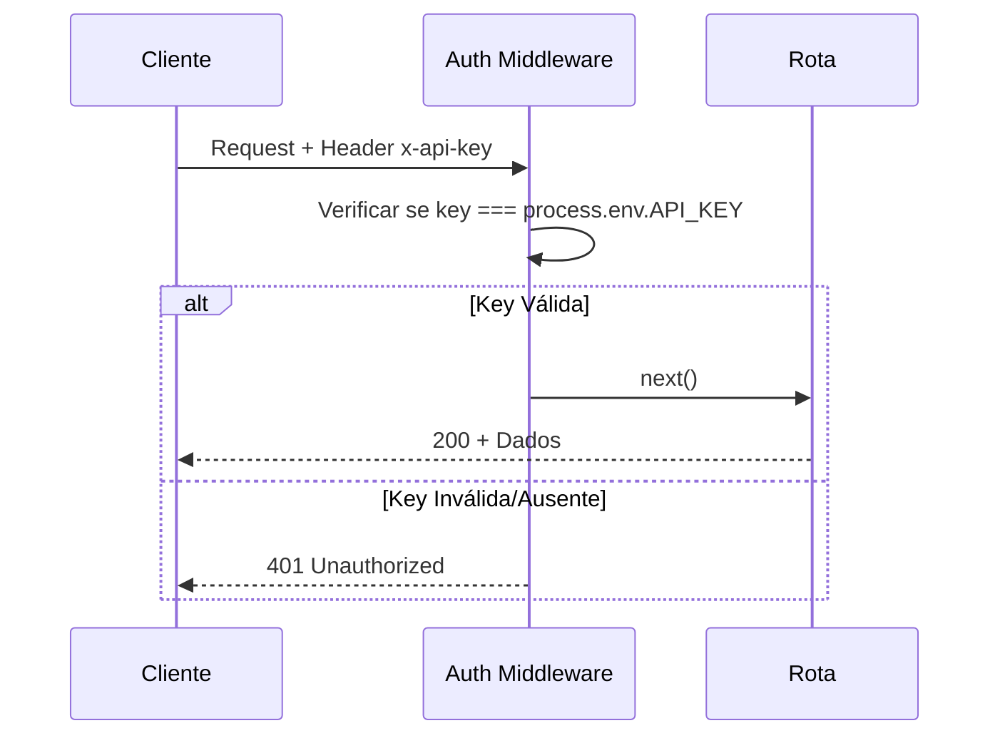

### 7.2 Código do Middleware de Autenticação

```javascript
// src/middleware/auth.js
const auth = (req, res, next) => {
    // 1. Extrair API Key do header
    const apiKey = req.header('x-api-key');
    
    // 2. Comparar com a chave no .env
    if (!apiKey || apiKey !== process.env.API_KEY) {
        return res.status(401).json({ 
            erro: 'Acesso negado. API Key inválida ou ausente.' 
        });
    }
    
    // 3. Se válida, continuar
    next();
};
```

### 7.3 Variáveis de Ambiente (.env)

```env
PORT=3000
API_KEY=a79301
```

**Por que usar .env?**
- Separar configuração do código
- Não expor segredos no Git
- Facilitar diferentes ambientes (dev/prod)

### 7.4 Outras Medidas de Segurança

| Medida | Implementação | Propósito |
|--------|---------------|-----------|
| **Helmet** | Headers HTTP | Previne XSS, clickjacking |
| **CORS** | Cross-Origin | Controla quem pode aceder |
| **Prepared Statements** | SQLite queries | Previne SQL Injection |

**SQL Injection Prevention:**
```javascript
// ❌ VULNERÁVEL
db.exec(`SELECT * FROM users WHERE nome = '${userInput}'`);

// ✅ SEGURO (Prepared Statement)
db.prepare('SELECT * FROM users WHERE nome = ?').get(userInput);
```

---

## 8. Documentação OpenAPI/Swagger

### 8.1 O que é OpenAPI?

- Especificação padrão para descrever APIs REST
- Formato YAML ou JSON
- Permite gerar documentação interativa

### 8.2 Swagger UI

**Acesso:** http://localhost:3000/api-docs

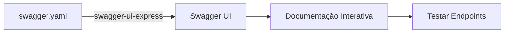

### 8.3 Estrutura do swagger.yaml

```yaml
openapi: 3.0.0
info:
  title: API Municípios de Portugal
  version: 1.0.0
  description: API REST para consulta de municípios

servers:
  - url: http://localhost:3000

paths:
  /api/municipios:
    get:
      summary: Lista todos os municípios
      security:
        - ApiKeyAuth: []
      parameters:
        - name: page
          in: query
          schema:
            type: integer
      responses:
        200:
          description: Lista paginada
        401:
          description: Não autorizado

components:
  securitySchemes:
    ApiKeyAuth:
      type: apiKey
      in: header
      name: x-api-key
```

---

## 9. Frontend e Interface

### 9.1 Arquitetura do Frontend

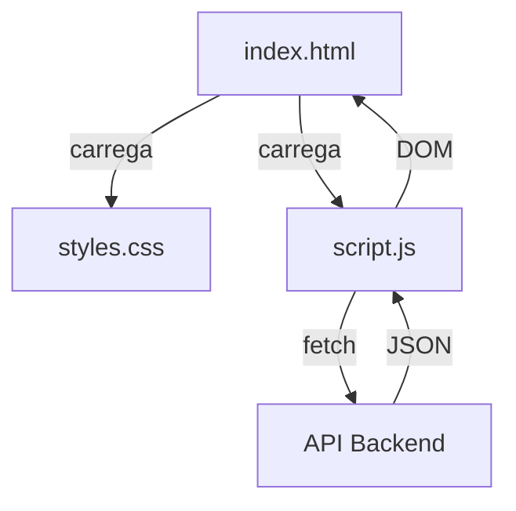

### 9.2 Comunicação com a API (Fetch)

```javascript
// public/script.js
async function loadData() {
    const apiKey = document.getElementById('apiKey').value;
    
    const response = await fetch('/api/municipios?page=1', {
        headers: {
            'x-api-key': apiKey
        }
    });
    
    if (!response.ok) {
        throw new Error('Erro na API');
    }
    
    const data = await response.json();
    renderData(data);
}
```

### 9.3 Renderização Dinâmica

```javascript
function renderData(data) {
    const container = document.getElementById('resultsGrid');
    
    container.innerHTML = data.data.map(municipio => `
        <div class="card">
            <h2>${municipio.nome}</h2>
            <p>Distrito: ${municipio.distrito}</p>
            <p>População: ${municipio.populacao2025}</p>
        </div>
    `).join('');
}
```

---

## 10. Fluxos de Dados Detalhados

### 10.1 Fluxo Completo: Listar Municípios

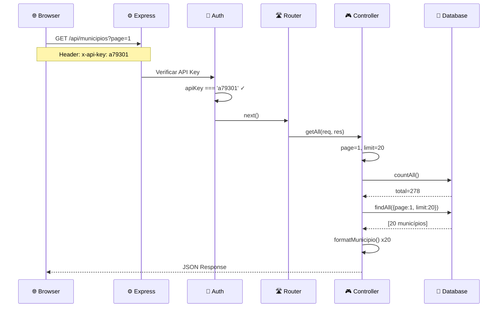

### 10.2 Fluxo: Pesquisa por Nome

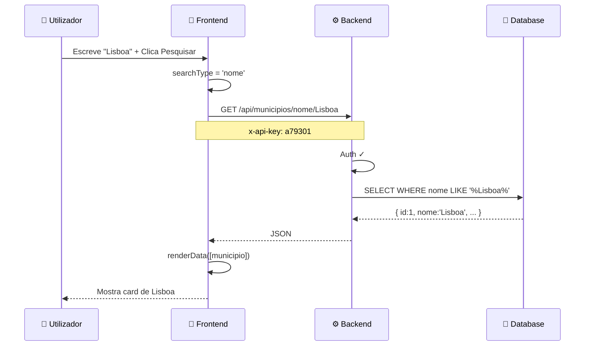

---

## 11. Componentes do Código

### 11.1 app.js - Entry Point

```javascript
// Carrega variáveis de ambiente
require('dotenv').config();

// Importa dependências
const express = require('express');
const cron = require('node-cron');
const helmet = require('helmet');
const cors = require('cors');

// Cria aplicação Express
const app = express();

// Aplica middlewares globais
app.use(helmet());      // Segurança
app.use(cors());        // Cross-origin
app.use(express.json()); // Parse JSON body
app.use(express.static('public')); // Servir frontend

// Monta rotas
app.use('/api/municipios', dadosRoutes);
app.use('/api-docs', swaggerUi.serve, swaggerUi.setup(swaggerDoc));

// Inicia sincronização
syncData(); // Imediata
cron.schedule('0 * * * *', syncData); // A cada hora

// Inicia servidor
app.listen(3000);
```

### 11.2 dadosRoutes.js - Rotas

```javascript
const router = express.Router();

// Aplica auth a TODAS as rotas
router.use(auth);

// Rotas específicas PRIMEIRO (ordem importa!)
router.get('/distrito/:distrito', controller.getByDistrito);
router.get('/codigo/:codigo', controller.getByCodigo);
router.get('/nome/:nome', controller.getByNome);

// Rotas genéricas
router.get('/', controller.getAll);
router.get('/:id', controller.getById);

// Rotas de escrita
router.post('/', controller.create);
router.put('/:id', controller.update);
router.delete('/:id', controller.remove);
```

### 11.3 dadosController.js - Lógica

```javascript
// Função auxiliar para formatar resposta
const formatMunicipio = (row) => ({
    _id: row.id,
    codigo: row.codigo,
    nome: row.nome,
    distrito: row.distrito,
    coordenadas: {
        latitude: row.latitude,
        longitude: row.longitude
    },
    populacao2025: row.populacao2025,
    densidade: row.densidade,
    ultimaAtualizacao: row.ultimaAtualizacao,
    fonte: row.fonte
});

// GET /api/municipios
exports.getAll = (req, res) => {
    const page = parseInt(req.query.page) || 1;
    const limit = parseInt(req.query.limit) || 20;
    
    const total = db.countAll();
    const dados = db.findAll({ page, limit });
    
    res.json({
        page,
        limit,
        total,
        totalPages: Math.ceil(total / limit),
        data: dados.map(formatMunicipio)
    });
};
```

### 11.4 database.js - Acesso a Dados

```javascript
const Database = require('better-sqlite3');
const db = new Database('data/municipios.db');

// Prepared statements (reutilizáveis e seguros)
const findByNome = (nome) => {
    return db.prepare(
        'SELECT * FROM municipios WHERE nome LIKE ? COLLATE NOCASE'
    ).get(`%${nome}%`);
};

const upsertMunicipio = (data) => {
    db.prepare(`
        INSERT INTO municipios (codigo, nome, distrito, ...)
        VALUES (@codigo, @nome, @distrito, ...)
        ON CONFLICT(nome) DO UPDATE SET ...
    `).run(data);
};
```

---

## 12. Perguntas Frequentes do Professor

### P: "Porque escolheram SQLite em vez de MongoDB?"

**R:** "Escolhemos SQLite porque:
1. Os dados são **estruturados e relacionais** (municípios com campos fixos)
2. **Não precisa de servidor** separado - é um único ficheiro
3. **Portabilidade** - posso copiar o ficheiro .db para outra máquina
4. Para este volume de dados (278 municípios), SQLite é mais que suficiente
5. MongoDB seria útil se tivéssemos dados com estrutura variável ou muito volume"

---

### P: "O que é middleware e para que serve?"

**R:** "Middleware são funções que processam pedidos **antes** de chegarem às rotas:

```
Request → [Helmet] → [CORS] → [Auth] → [Route] → Response
```

Usamos para:
- **Helmet**: Adiciona headers de segurança automaticamente
- **CORS**: Permite pedidos de outros domínios
- **Auth**: Valida a API Key antes de processar o pedido"

---

### P: "Como funciona a autenticação?"

**R:** "Usamos autenticação por **API Key**:
1. Cliente envia header `x-api-key: a79301`
2. Middleware extrai e compara com valor no `.env`
3. Se válida, pedido continua; se não, retorna 401

É simples mas eficaz para APIs internas. Para produção real, usaríamos JWT ou OAuth."

---

### P: "O que acontece se a API externa estiver offline?"

**R:** "O sistema é **resiliente**:
1. Temos dados **já sincronizados** na BD local
2. A sincronização falha silenciosamente (try/catch)
3. Tentamos novamente na próxima hora
4. Os dados existentes continuam disponíveis para consulta"

---

### P: "Como evitam SQL Injection?"

**R:** "Usamos **Prepared Statements**:

```javascript
// ❌ Vulnerável (concatenação)
db.exec(`SELECT * FROM x WHERE nome = '${input}'`);

// ✅ Seguro (prepared statement)
db.prepare('SELECT * FROM x WHERE nome = ?').get(input);
```

O `?` é substituído de forma segura, escapando caracteres especiais."

---

### P: "Explica o fluxo de um pedido GET."

**R:** "
1. **Cliente** faz `GET /api/municipios` com header `x-api-key`
2. **Express** recebe e passa pelos middlewares
3. **Auth** valida a API Key
4. **Router** identifica a rota correta
5. **Controller** executa a lógica de negócio
6. **Database** executa query SQL
7. **Controller** formata dados em JSON
8. **Response** volta ao cliente com status 200"

---

### P: "Para que serve o Swagger?"

**R:** "O Swagger/OpenAPI serve para:
1. **Documentar** a API de forma padronizada
2. **Testar** endpoints interativamente no browser
3. **Gerar** código cliente automaticamente
4. Seguir o **standard da indústria** para APIs REST"

---

### P: "Porque sincronizam a cada hora e não em tempo real?"

**R:** "
1. **Dados geográficos** mudam raramente (municípios não mudam todos os dias)
2. Não sobrecarregamos a **API externa** com pedidos constantes
3. **Eficiência** - uma sincronização completa demora ~30 segundos
4. Se precisássemos de dados em tempo real, usaríamos webhooks ou WebSockets"

---

### P: "O que é REST?"

**R:** "REST (Representational State Transfer) é um estilo arquitetural para APIs:
- **Stateless**: Cada pedido é independente
- **Uniform Interface**: URLs e métodos padronizados
- **CRUD via HTTP**: GET=Read, POST=Create, PUT=Update, DELETE=Delete
- **Recursos**: Cada URL representa um recurso (ex: `/municipios`)"

---

### P: "Porque usam `better-sqlite3` e não `sqlite3`?"

**R:** "
- **Síncrono**: API mais simples, sem callbacks/promises
- **Performance**: 2-3x mais rápido que sqlite3
- **Prepared Statements**: Suporte nativo e eficiente
- Para este projeto não precisamos de async porque as queries são rápidas"

---

## 13. Glossário de Termos

| Termo | Definição |
|-------|-----------|
| **API** | Application Programming Interface - contrato de comunicação entre sistemas |
| **REST** | Estilo arquitetural para APIs web baseado em recursos e verbos HTTP |
| **Endpoint** | URL específico que responde a pedidos (ex: `/api/municipios`) |
| **CRUD** | Create, Read, Update, Delete - operações básicas de dados |
| **Middleware** | Função que processa pedidos entre receção e resposta |
| **JSON** | JavaScript Object Notation - formato de dados texto |
| **HTTP** | Protocolo de comunicação web |
| **Query Parameter** | Parâmetro na URL após `?` (ex: `?page=1`) |
| **Path Parameter** | Parâmetro na URL como segmento (ex: `/nome/Lisboa`) |
| **Header** | Metadados enviados com pedido/resposta HTTP |
| **Status Code** | Código numérico indicando resultado (200=OK, 404=Not Found) |
| **Prepared Statement** | Query SQL pré-compilada com placeholders |
| **Upsert** | Insert + Update - insere se não existe, atualiza se existe |
| **Cron** | Sistema de agendamento de tarefas baseado em expressões temporais |
| **ORM** | Object-Relational Mapping - camada entre objetos e BD relacional |
| **Swagger** | Ferramenta para documentar e testar APIs |
| **OpenAPI** | Especificação padrão para descrever APIs REST |
| **CORS** | Cross-Origin Resource Sharing - permite pedidos entre domínios |
| **SQL Injection** | Ataque que insere código SQL malicioso em queries |
| **Environment Variables** | Configurações externas ao código (ex: .env) |

---

## 📝 Checklist de Preparação

Antes da apresentação, confirma que sabes:

- [ ] Explicar o que o projeto faz em 30 segundos
- [ ] Desenhar a arquitetura no quadro
- [ ] Explicar o fluxo de um pedido GET
- [ ] Explicar como funciona a autenticação
- [ ] Justificar escolha de SQLite vs MongoDB
- [ ] Explicar o que é REST e os verbos HTTP
- [ ] Mostrar como funciona o Swagger
- [ ] Explicar como evitamos SQL Injection
- [ ] Descrever o processo de sincronização
- [ ] Identificar cada ficheiro e sua função

---

**Boa sorte na apresentação! 🎓**

*Documento criado em Dezembro 2025*
