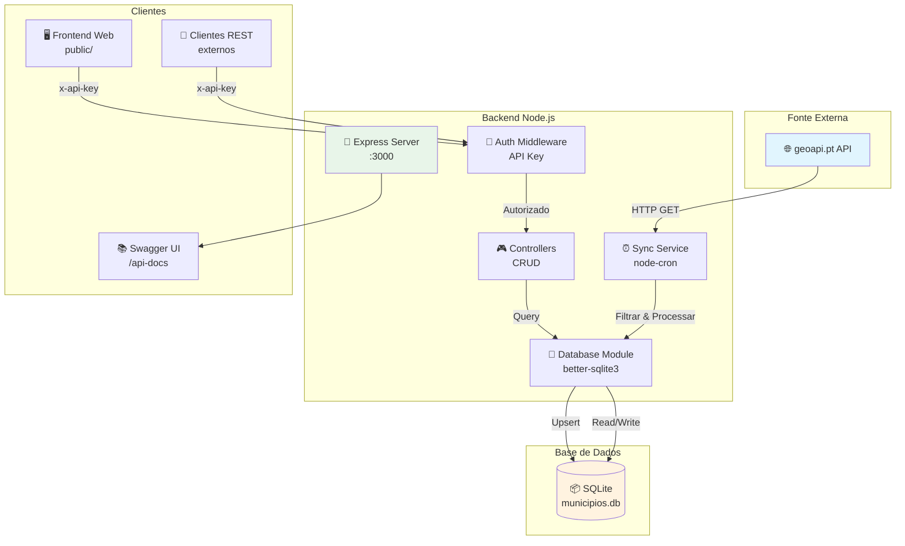
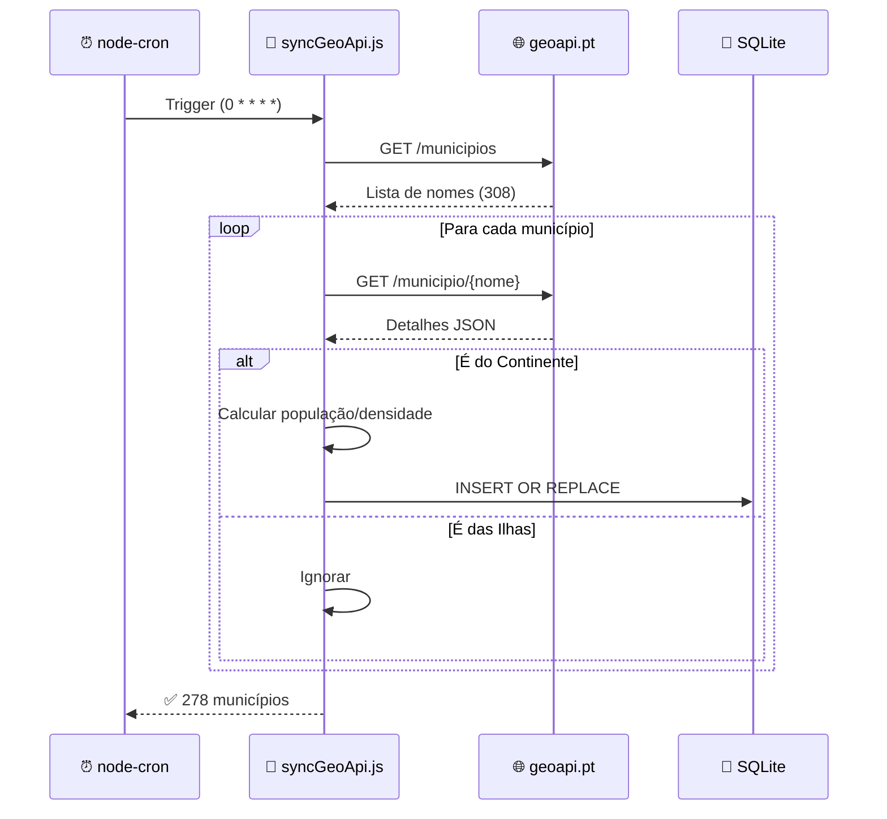
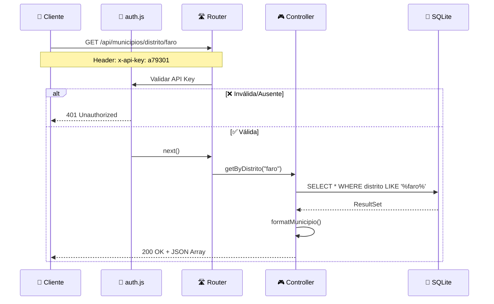
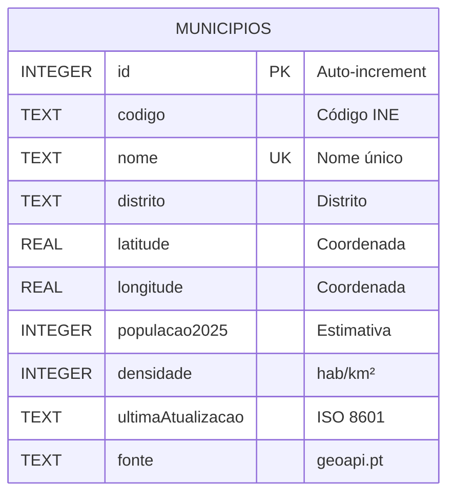
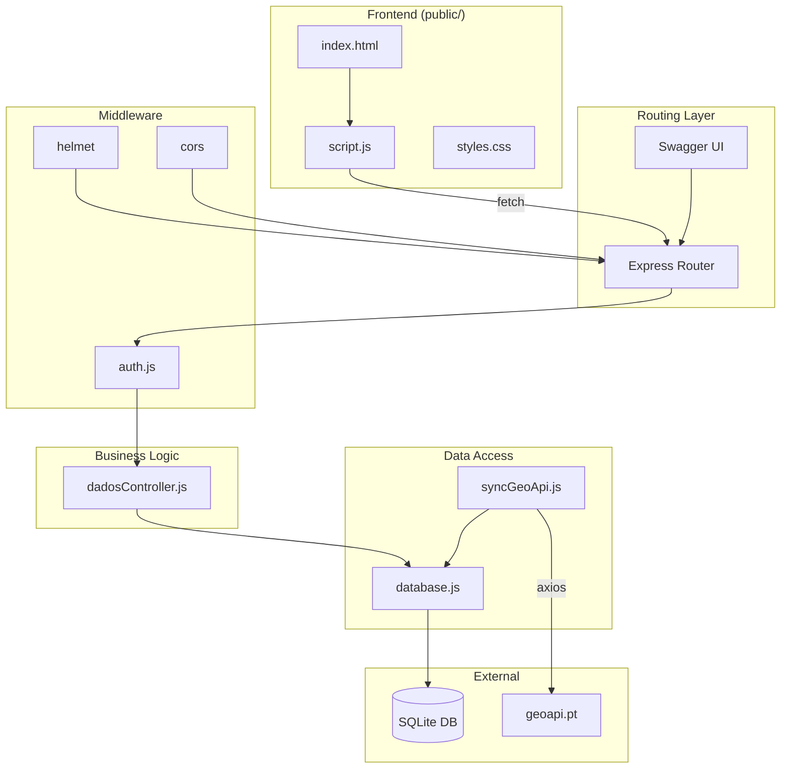

# Desenho e Arquitetura do Sistema  
**Projeto de Integração de Sistemas de Informação**  
Disciplina: Desenvolvimento de Aplicações Web  
Data: 7 de dezembro de 2025  
Autores: Bernardo Freitas & Tomás Anastácio / Grupo a79295_a79301

---

## 1. Visão Geral da Arquitetura

O sistema é composto por três grandes componentes principais:

1. **Fonte de Dados Externa**  
   API pública portuguesa: **https://json.geoapi.pt** (explicitamente sugerida no enunciado)  
   Endpoints utilizados:
   - `GET https://json.geoapi.pt/municipios` → lista de todos os municípios  
   - `GET https://json.geoapi.pt/municipio/{nome}` → detalhes de cada município

2. **Sistema Local (Backend Node.js)**  
   - Framework: Express.js 5.x  
   - Base de dados: **SQLite** (via better-sqlite3)  
   - Sincronização automática via node-cron (agendada a cada hora)  
   - Filtragem: exclui Açores e Madeira (apenas continente)  
   - Processamento: enriquecimento dos dados com campos calculados (população estimada 2025, densidade populacional, timestamp de atualização)  
   - Segurança: autenticação via API Key (header `x-api-key`)

3. **API REST Exposta para Consumo Externo**  
   - Base URL: `/api/municipios`  
   - Operações CRUD completas  
   - Documentação dinâmica com Swagger UI (OpenAPI 3.0) disponível em `/api-docs`

---

## 2. Diagrama de Arquitetura



---

## 3. Fluxos de Dados Detalhados

### Fluxo 1 – Sincronização Automática (agendada)



**Passos detalhados:**
1. node-cron dispara a cada hora (`0 * * * *`) + ao iniciar o servidor
2. Requisição GET para `https://json.geoapi.pt/municipios` (lista de nomes)
3. Para cada nome, GET `https://json.geoapi.pt/municipio/{nome}`
4. Filtragem: descarta municípios dos distritos "Açores", "Madeira" e variantes
5. Processamento: cálculo de população estimada 2025 e densidade (hab/km²)
6. Upsert (INSERT OR REPLACE) no SQLite usando o campo `nome` como chave única

### Fluxo 2 – Consulta via API REST



---

## 4. Modelo de Segurança

| Mecanismo | Implementação | Observações |
|-----------|---------------|-------------|
| **Autenticação** | API Key via header `x-api-key` | Valor definido em `.env` |
| **Validação** | Middleware `auth.js` | Retorna 401 se inválida |
| **Proteção de rotas** | Todas as `/api/municipios/*` | Exceto `/api-docs` (público) |
| **Headers HTTP** | Helmet.js | XSS, CSRF, clickjacking |
| **CORS** | cors middleware | Configurável por origem |

---

## 5. Design da API REST (Endpoints)

| Método | Endpoint | Descrição | Query Params | Auth |
|--------|----------|-----------|--------------|------|
| GET | `/api/municipios` | Lista todos (paginado) | `page`, `limit`, `distrito` | ✅ |
| GET | `/api/municipios/:id` | Por ID numérico | - | ✅ |
| GET | `/api/municipios/nome/:nome` | Por nome (parcial) | - | ✅ |
| GET | `/api/municipios/codigo/:codigo` | Por código INE | - | ✅ |
| GET | `/api/municipios/distrito/:distrito` | Por distrito | - | ✅ |
| POST | `/api/municipios` | Criar município | body JSON | ✅ |
| PUT | `/api/municipios/:id` | Atualizar | body JSON | ✅ |
| DELETE | `/api/municipios/:id` | Remover | - | ✅ |

**Exemplo de resposta paginada:**
```json
{
  "page": 1,
  "limit": 20,
  "total": 278,
  "totalPages": 14,
  "data": [...]
}
```

---

## 6. Modelo de Dados (SQLite)

### Diagrama ER



### Schema SQL

```sql
CREATE TABLE municipios (
    id INTEGER PRIMARY KEY AUTOINCREMENT,
    codigo TEXT,
    nome TEXT NOT NULL UNIQUE,
    distrito TEXT NOT NULL,
    latitude REAL,
    longitude REAL,
    populacao2025 INTEGER,
    densidade INTEGER,
    ultimaAtualizacao TEXT DEFAULT CURRENT_TIMESTAMP,
    fonte TEXT DEFAULT 'geoapi.pt'
);

-- Índices para performance
CREATE INDEX idx_distrito ON municipios(distrito);
CREATE INDEX idx_codigo ON municipios(codigo);
CREATE INDEX idx_ultimaAtualizacao ON municipios(ultimaAtualizacao DESC);
```

### Exemplo de registo

```json
{
  "_id": 1,
  "codigo": "0802",
  "nome": "Albufeira",
  "distrito": "Faro",
  "coordenadas": {
    "latitude": 37.0892,
    "longitude": -8.2500
  },
  "populacao2025": 44000,
  "densidade": 315,
  "ultimaAtualizacao": "2025-12-07T15:42:09.191Z",
  "fonte": "geoapi.pt"
}
```

---

## 7. Arquitetura de Componentes



---

## 8. Tecnologias Escolhidas

| Camada | Tecnologia | Versão | Justificação |
|--------|------------|--------|--------------|
| Runtime | Node.js | 18+ LTS | Obrigatório no enunciado |
| Framework | Express.js | 5.x | Leve, padrão da indústria |
| Base de Dados | **SQLite** | 3.x | Portabilidade, zero config |
| Driver BD | better-sqlite3 | 11.x | Síncrono, alta performance |
| HTTP Client | Axios | 1.x | Robusto para chamadas API |
| Agendamento | node-cron | 4.x | Simples e confiável |
| Documentação | Swagger UI | 5.x | OpenAPI 3.0 exigido |
| Segurança | Helmet + CORS | - | Proteção HTTP headers |

### Porquê SQLite em vez de MongoDB?

| Aspeto | SQLite | MongoDB |
|--------|--------|---------|
| **Setup** | Zero config, ficheiro único | Requer servidor |
| **Portabilidade** | `municipios.db` (~500KB) | Dump/restore complexo |
| **Modelo de dados** | Tabular (ideal para municípios) | Documental (overkill) |
| **Queries** | SQL nativo | Aggregations complexas |
| **Performance** | Excelente para leituras | Melhor para writes massivos |

---

## 9. Plano de Implementação

| Fase | Atividades | Estado |
|------|------------|--------|
| **Fase 1** | Escolha API externa, arquitetura | ✅ Concluído |
| **Fase 2** | Documentação de arquitetura | ✅ Concluído |
| **Fase 3** | Backend + Sincronização + CRUD | ✅ Concluído |
| **Fase 4** | Swagger + Segurança + Frontend | ✅ Concluído |
| **Fase 5** | Testes, documentação final | ✅ Concluído |

---

## 10. Instruções de Execução

```bash
# Instalar dependências
npm install

# Configurar variáveis de ambiente
echo "PORT=3000" > .env
echo "API_KEY=a79301" >> .env

# Executar
npm start

# Aceder
# API: http://localhost:3000/api/municipios
# Swagger: http://localhost:3000/api-docs
# Frontend: http://localhost:3000
```

---

**Documento atualizado em:** 7 de dezembro de 2025